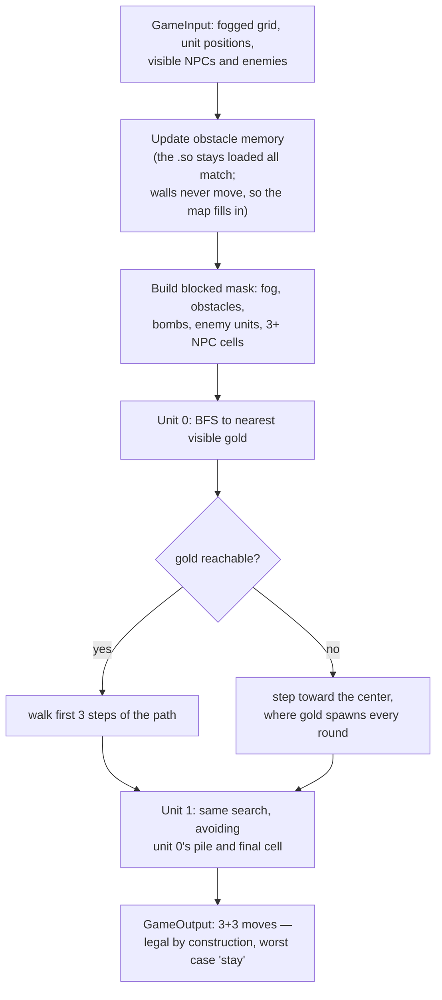

# GoldRush 2.0 Bot — Top 25 of ~500 Teams

A C++ bot for **GoldRush 2.0**, Ubiquant's algorithmic-game competition:
two players, two units each, fighting over gold on a fogged 17×17 grid for
500 rounds. This bot finished in the **top 25 of roughly 500 teams**, and
its winning idea is deliberately contrarian: while the field built complex
planners, this bot wins with **correctness by construction and microsecond
latency** — because in this game, *speed is a rule, not a nicety*.

## The game in 30 seconds

Each round the engine calls `moveDecision()` with what your two units can
see (a 5×5 window each; everything else is fog) and you return 6 moves
split between them. Gold spawns mostly in the central 9×9; entering a
pile grabs 65% of it. Obstacles block, bombs cost 10% of held gold, and
seven NPCs also farm the board. Two rules shape everything:

1. **A malformed answer, crash, or timeout forfeits the match instantly.**
2. **The faster-answering player moves first every round** — before the
   NPCs and before the opponent — and first pick of a contested pile is
   worth 65% of it. Ties in final gold go to the lower P90 latency.

## The bot in one diagram



That's the whole decision: one BFS per unit over known-safe cells, a
center-drift fallback, and hard collision avoidance between our own units
(the first mover's landing cell is a wall for the second).

## Why it wins

- **~1.5 µs P90 decision time, measured by the contest engine** on match
  hardware — about 200,000× under the 300 ms budget. Against nearly every
  opponent this bot moved *first every single round*, taking 65% of each
  contested spawn before the NPC swarm and the opponent even acted.
- **It cannot lose by accident.** The output starts as a legal "both units
  stay" and is only ever refined; every step targets a cell known to be
  in-bounds, un-walled, bomb-free and NPC-safe. Zero crashes, zero
  malformed rounds, zero timeouts across the entire tournament.
- **It learns the map while playing.** Obstacles are static, so every wall
  ever seen is remembered for the rest of the match — pathing sharpens
  round by round. State resets itself when the round counter restarts.
- **Zero dependencies, zero allocations, zero I/O.** Plain arrays and
  ~200 lines of logic; `ldd` shows libc only. Nothing to page in, nothing
  to jitter: worst-case rounds stay microsecond-class, which is exactly
  what a P90 metric rewards.

The lesson we'd pass on: in latency-ordered games, a simple bot that is
*never wrong and always first* beats a clever bot that is occasionally
slow. We built substantially fancier planners during the beta (belief
maps, seat inference, a full local match simulator) — the ladder kept
crowning this one.

## Build and test

Linux + g++ is all you need:

```bash
make        # -> player.so, the artifact the engine dlopens
make test   # offline harness + latency benchmark
```

The harness (`test/local_test.cpp`) loads `player.so` through `dlopen`
exactly like the real engine, replays scripted scenarios (routing around
obstacles and bombs, boxed-in corners, NPC crowds, enemies camping gold)
with ASCII board printouts, validates every output field, and benchmarks
20,000 decisions (p50/p90/max).

## Layout

```
src/game_api.h    contest ABI (structs the engine shares with the bot)
src/constants.h   cell values and action codes from the rules
src/player.cpp    the bot — the entire strategy lives here
test/             dlopen harness: correctness scenarios + latency bench
```
